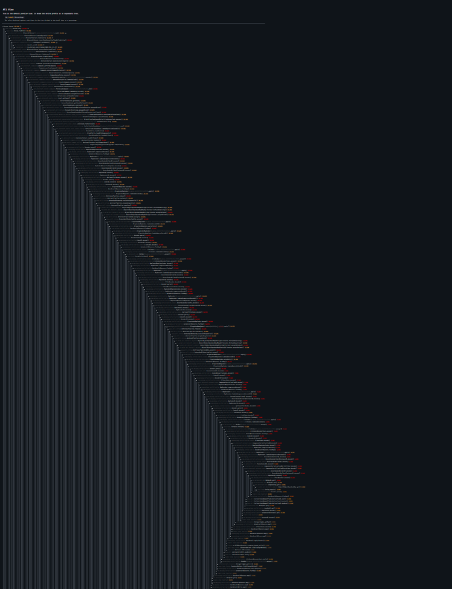
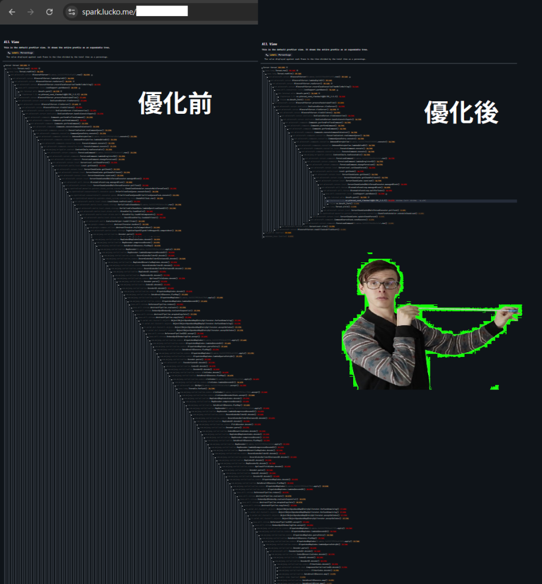

# LazyContainerAgent

[中文](README.md) ｜ **English**

> **A Java agent that lazily deserializes container items, and writes untouched containers back byte-for-byte.**
> Built for **Paper 1.21.11**. It removes two pieces of wasted work that cause Minecraft server lag: unpacking every chest's items from NBT on chunk load, and re-packing them on unload.

> *Keywords: Minecraft, Paper, performance, lag, TPS, chunk loading, container/chest/barrel/shulker box, NBT deserialization, data components, map art, Java agent, ASM, optimization, spark profiler.*

⚠️ **This is a Java agent, NOT a plugin** — attach it with `-javaagent:`. **Do not drop it in `plugins/`** (it does nothing there).

> 🔒 **Version-sensitive (read first)**
> This agent weaves bytecode **directly into Paper 1.21.11 / Java 21** internals (classfile major 65). It is **version-locked**.
> - **For Paper 1.21.11 + Java 21 only.** Do not use it on any other Minecraft or Java version.
> - Porting requires: ① recompile `template/` against the matching NMS, ② bump ASM to read the target classfile version, ③ re-validate with shadow mode.
> - On a version mismatch it **throws on boot or on the first container load** (`VerifyError` / `NoSuchMethodError`). This is a deliberate **fail-stop**: it never silently corrupts or loses data, but the node will not start — so test in a staging environment first.

---

## Quick start

> Requires **Paper 1.21.11 + Java 21**.

**1. Drop the jar** somewhere the node can see it (next to your server jar is easiest). **Not** in `plugins/` — it's a Java agent, not a plugin.

**2. Add the flag** on the `java` line, **before** `-jar` (use shadow-validation mode the first time):

```bash
java ... \
  -javaagent:LazyContainerAgent.jar \
  -Dlazycontainer.shadow=true \
  -Dlazycontainer.verbose=true \
  -jar <your-Paper>.jar nogui
```

**3. Validate first — don't jump straight to performance.** Run with `shadow=true` for a few days. It byte-compares the optimized output against vanilla; as long as `shadowMismatch` stays **0**, the output is byte-identical to vanilla — **zero data risk**. (Trade-off: shadow mode runs both paths, so no speedup yet.)

**4. Switch to real performance.** Once `shadowMismatch=0` holds for a few days and nobody reports missing items, remove `-Dlazycontainer.shadow=true` and restart. Untouched containers are now written back as-is, skipping the re-pack.

**Rollback:** remove the flags and restart → back to 100% vanilla, **no data migration** (the on-disk format was never changed).

---

## What it solves

Run a server long enough and you hit a strange kind of lag: barely anyone online, yet the main thread is busy. Profile it with spark and the culprit is often **chests** — or rather, the items inside them.

Minecraft stores items packed/compressed on disk. Every time a chunk loads, the server **unpacks every item in every container in that chunk from NBT**; when the chunk unloads, it **packs them all again**. But the vast majority of containers are **never opened** between load and unload — pure wasted work. Since 1.21, items carry data components (enchantments, lore, custom names, nested container contents), making pack/unpack even more expensive. A warehouse full of map art, or a storage line packed with shulker boxes, can eat a large fraction of the main thread just from being loaded.

The lazy approach, in one sentence:

> **Don't unpack a container nobody is looking at; write an untouched container back as-is.**

On load, keep the raw item bytes stashed and skip the decode. Only when something actually accesses the container — a player opens it, a hopper pulls, a comparator reads — is that **one** container decoded. Containers untouched from load to unload are written back byte-for-byte, skipping the re-encode.

To the rest of the game it behaves exactly like vanilla — same items, same slots, indistinguishable. The only difference is on the server: all that "unpack-and-repack that nobody looked at" work is gone.

---

## Benchmark: a ~206-deep "hadouken" callstack → 0%

Loading one chest of map art, just to decode the items from NBT, produces a callstack roughly **206 frames** deep — because the data is genuinely nested (chest → shulker box → map → lore → multi-colored text) multiplied by Mojang's codec combinator framework (~15–20 frames per field). The deepest frame is merely `TextColor.parseColor` / `String.equals`.

<p align="center">

&nbsp;&nbsp;

</p>

Same dense-container chunk, `forceload` churn, two runs:

| Run | Mode | spark | container decode (main thread) | profile nodes | deepest call |
|---|---|---|---|---|---|
| 1 | vanilla | `WOVkupfiJx` | **62.17%** | 3378 | 200 |
| 1 | **agent** | `wGDbUTbZKN` | **0.00%** | 482 | 9 |
| 2 | vanilla | `AjXLAdXzTd` | **65.65%** | 4305 | 200 |
| 2 | **agent** | `caXFofKSVQ` | **0.00%** | 763 | 36 |

The entire decode tower **disappears** from the agent profile. Static spark profiles (saved so the links can't expire) + the full 206-line callstack + notes: [`docs/spark/`](docs/spark/SUMMARY.md).

> The 62–66% is an **isolated** stress test (containers only). On a real mixed-load server it is ~24% on load + ~11% on unload (up to ~45% on the heaviest node). It saves the pack/unpack CPU — not disk I/O or GC.

**Real-world login test** — a player's storage area of ~6,000 chests holding ~750,000 filled maps, copied to a test server:

| | Vanilla | Agent |
|---|---|---|
| Loading the area | main thread **frozen 25–30 s** (watchdog) | no decode freeze |
| Player login | **repeatedly kicked (lost connection)**, couldn't get in | **single clean login** |
| Item deserialization | all 750k maps decoded → crash | **`ensure=0` — not a single one decoded** |

---

## How it works

Like a moving company that used to open and reseal every box passing through the warehouse — even the ones nobody asked about. Now: don't open what nobody wants; ship the untouched ones sealed.

It injects the NMS container classes, adds two synthetic fields, and rewrites the access points:

| Action | Counter | What it does |
|---|---|---|
| **Lazy load** | `stash` | `loadAdditional` does not call `ContainerHelper.loadAllItems`; it stashes the raw, undecoded `Items` ListTag and marks `pending`. **Skips decode.** |
| **Materialize on access** | `ensure` | The first call to `getItems()/getContents()` decodes the stashed raw into the list (only that one container). |
| **Write back as-is** | `rawSave` | On save, if the container was never touched (`pending`), the original bytes are written back byte-for-byte. **Skips encode.** |
| **Eager fallback** | `eagerLoad` | If the input isn't `TagValueInput` (shouldn't happen) → safe fallback to vanilla behavior. |

Covers `ChestBlockEntity`, `BarrelBlockEntity`, `ShulkerBoxBlockEntity`. The **single chokepoint is `getItems()`** — every container read/write in NMS `BaseContainerBlockEntity` goes through it, so guarding one point covers them all; CraftBukkit's `getContents()` bypasses it and is guarded separately.

### Architecture

A plain plugin can't override NMS final methods, so this uses a **Java agent + ASM bytecode injection**:

1. `LazyContainerAgentMain` (premain): appends the jar to the bootstrap classloader (to get past Paper's isolated classloader), then registers the transformer.
2. `LazyContainerTransformer` (ASM): splices `LazyContainerTemplate` (logic compiled against real NMS, so the compiler verifies the signatures — safer than hand-written ASM) into `BaseContainerBlockEntity`, and redirects the leaf load/save `ContainerHelper` calls to the lazy versions.
3. `LazyContainerRuntime` (bootstrap, pure JDK): shadow toggle + counters.
4. **Safety rule:** if the base class isn't spliced successfully, the leaves are left completely untouched → falls back to pure vanilla; any exception → returns the original bytes.

---

## Why it doesn't lose or alter data

It changes **when** items are decoded, not **what** a container stores. The on-disk format never changes.

- **Untouched containers** → the exact bytes read on load are written back (byte-identical), with no transformation.
- **Touched containers** → decoded and saved exactly like vanilla.
- Only the container's `Items` are affected — never terrain, blocks, entities, lighting, or other block entities.

Validated by: offline JVM bytecode verification; real Paper 1.21.11 end-to-end round-trips (byte-identical, including data components); an adversarial review across 8 failure modes (0 data-affecting paths). See [`FINDINGS.md`](FINDINGS.md), [`ADVERSARIAL-REVIEW.md`](ADVERSARIAL-REVIEW.md).

---

## shadow mode (run this before going live)

`-Dlazycontainer.shadow=true`: before writing raw, it **also** runs vanilla's encode and byte-compares the two.
- **Match** → write raw.
- **Mismatch** → write vanilla's version (safe), increment `shadowMismatch`, log the position.

With shadow on, the on-disk output is mathematically identical to vanilla — zero-risk validation. No speedup while it's on (both paths run). Run a few days at `shadowMismatch=0`, then turn it off for real performance.

### `shadowMismatch` vs `benignReorder`

A byte-strict compare false-positives on "same items, just a different `Items` list order" (common for plugin-written containers — each entry carries its own `Slot`, so list order doesn't affect placement). So the compare is split:

- **`benignReorder`** — same items and slots, only the list order differs (verified as a multiset) → safe to write raw, not a problem. Still detected and logged as `NO IMPACT`.
- **`shadowMismatch`** — a real structural difference (item count/content changed) → write vanilla's version + log.

Watch **`shadowMismatch=0`**. With `-Dlazycontainer.dump=true`, both kinds dump raw/eager SNBT for offline diff (`lc-mismatch-N` / `lc-benign-N`).

---

## Build

```bash
bash build.sh   # JDK 21; outputs target/LazyContainerAgent.jar
```

Needs `nms-lib/` (your Paper server core's NMS libraries, for `template/` to compile against real NMS). Not committed to git — place it before building.

## Flags

| Flag | Effect |
|---|---|
| `-Dlazycontainer.shadow=true` | **Required before going live.** Output guaranteed identical to vanilla; no speedup yet. |
| `-Dlazycontainer.verbose=true` | Background thread prints the counters periodically. |
| `-Dlazycontainer.verbose.ms=8000` | Counter interval (ms, default 30000). |
| `-Dlazycontainer.dump=true` | On mismatch / benign reorder, dump raw/eager SNBT (`lc-mismatch-N` / `lc-benign-N`, first 30 each) for offline diff. |
| `-Dlazycontainer.dump.dir=<path>` | Dump output directory (default `.`). |

---

## Limitations

- **Benefit depends on containers being untouched.** Churn / idle storage (load → nobody touches → unload) wins big; a busy hopper/comparator sorting hall materializes containers, so the pure savings shrink (the main benefit there becomes "spread the load-time spike out").
- **Version-locked** to Paper 1.21.11 / Java 21. A mismatch fails loudly (VerifyError/NoSuchMethod), never silently.
- Does **not** save disk I/O or GC — only the pack/unpack CPU.

---

Crafted by 廢土貓大 LogoCat · [mcfallout.net](https://mcfallout.net)
